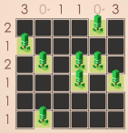

# <p align="center">School Project</p>

## School and Course


[Instituto Superior Técnico](https://tecnico.ulisboa.pt/)

[Engenharia Informática e de Computadores](https://tecnico.ulisboa.pt/en/education/courses/undergraduate-programmes/computer-science-and-engineering/)

## Class Subject and Goals
### Class: [Logic for Programming](https://fenix.tecnico.ulisboa.pt/cursos/leic-t/disciplina-curricular/1408903891910857)

### Goals

- Deductive system
- Logic programming paradigm
 
### Grade: 19/20 


## Problem Specification
A friend asks for your help organizing a summer festival: she needs a program that indicates where the tents should be located event. The rules are as follows: so that the participants aren't all crammed together, each tree should be associated with a single tent and the tents should not be next to each other.

The description of the problem reminds you of an app called “Tents and Trees” and you decide to start by implementing a program that solves these puzzles; then it won't be a problem to extend the program to a real scenario. Of course, as you're learning the wonderful Prolog, you decide that the implementation will be in Prolog.

So, you study the rules of the game “Tents and Trees” ([Section 1](#1-the-tents-and-trees-puzzle)) and, even though you haven't yet data structures, you define the data structure you will use ([Section 2](#2-data-structures)).

Thanks and have fun!


### 1-The “Tents and Trees” puzzle:
You are given a board (assume an NxN matrix), which has trees in certain positions. You are also given integer values, indicating how many tents should be in each row/column. Image 1 shows an initial puzzle. The values in the first row and column
indicate the number of tents that should be in each column and row.
<p align="center"></p>
Image 1: Example of a starter puzzle


The aim is to place a tent in the vicinity - position immediately above, immediately below, immediately to the left or immediately to the right - of each tree, respecting the given number of tents per row and column, and bearing in mind that you can't have a tent in the extended vicinity of another tent. In other words, once a tent has been placed, there can be no other tent either in the position immediately above, or in the position immediately below, nor in the position immediately to the left, nor in the position immediately to the right, nor in the diagonal positions.

Note: there can be more than one tent in the vicinity of a tree; what must be guaranteed is that, in the end, it is possible to assign one and only one tent to each tree, being that tent is in its neighborhood.

Image 2 shows an almost solved puzzle. Note that, for example, if there is a tent
in position (1,1) there cannot be a tent in positions (1, 2) and (2, 2) (nor in position (2, 1) which, in this case anyway, is already occupied by a tree).

<p align="center"></p>

### 2-Data structures
A puzzle will be represented by a triple, containing:
- A board, consisting of a matrix (a list of lists), where each list represents a row of the puzzle;
- A list representing the exact number of tents there should be per row;
- A list representing the exact number of tents there should be per column.
Thus, the puzzles in Image 1 and Image 2 will be represented, respectively, as follows (“a” to represent “tree”, “t” to represent “tent” and “r” to represent “grass”):<br>
<b>([<br>
[_, _, _, _, a, _],<br>
[a, _, _, _, _, _],<br>
[_, a, _, a, a, _],<br>
[_, _, _, a, _, a],<br>
[_, _, _, _, _, _],<br>
[_, a, _, _, _, _]],<br>
[2,1,2,1,1,1],<br>
[3,0,1,1,0,3])<br>
([<br>
[t, r, r, r, a, _],<br>
[a, r, r, t, r, r],<br>
[t, a, r, a, a, t],<br>
[r, r, t, a, r, a],<br>
[r, r ,r, r, r, t],<br>
[t, a, r, r, r, r]],<br>
[2,1,2,1,1,1],<br>
[3,0,1,1,0,3]).<br></b>


## Configuration

### 1 - Install SWI-Prolog 
To run the program you need to have SWI-Prolog installed. Please go to https://www.swi-prolog.org/download/stable and install the correct version for your OS.

### 2 - Running Prolog:

Open a terminal window at the .pl files folder and run:
```bash
swipl
```
It will open a prolog session and load the files current path.
There are several boards at 'puzzlesAcampar.pl' already named, you can use them or create other boards.
For simplification purposes, let´s use one already built.
To solve a puzzle just run:
```bash
puzzle(6-13, P), resolve(P).
```

<h2>Credits</h2>

- Author: <a href="https://github.com/iribeirocampos" target="_blank">Iuri Campos</a>

<h2>Copyright</h2>
This project is licensed under the terms of the MIT license and protected by IST Honor Code and Community Code of Conduct. 


